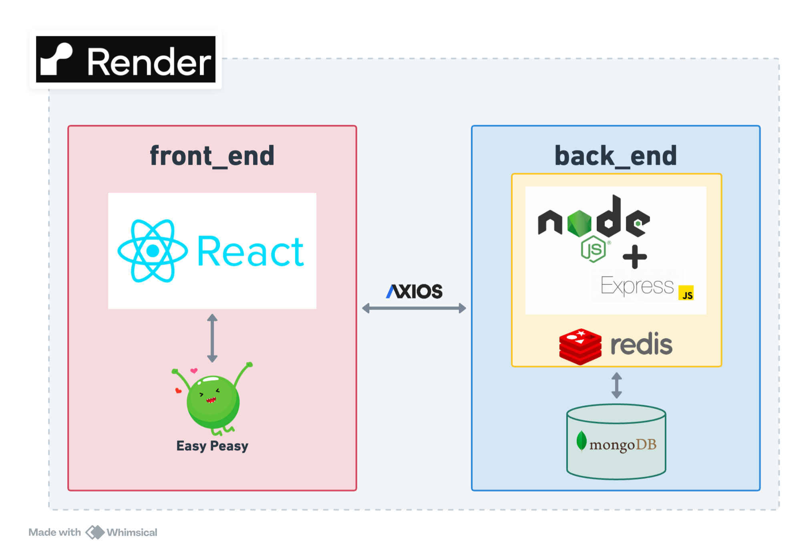

# MERN (MongoDB Express React Node.js) 架構開發書店網站(Back_end)

網站連結：[bookShop](https://bookshop-8u9l.onrender.com)

## 技術說明

### 後端

-   框架：`Node.js Express`
-   `RESTful API` & `MVC` 架構
-   `Google OAuth 2.0` & `JWT`
-   `Roles auth`：達到身份驗證

### 資料庫

-   `MongoDB`：使用 NoSQL 達到更高效查詢，且增加擴展性。
-   `Redis`：書籍預載快取，達到更高效能

### 部署

-   `Render`進行部署

### API

-   /users (Access：Admin only)
    -   管理使用者 CRUD
-   /books
    -   get: 取得所有書籍 (Access：Public)
    -   post: 新增書籍 (Access：Editor, Admin)
    -   patch: 修改書籍資訊 (Access：Editor, Admin)
    -   delete: 刪除書籍 (Access：Editor, Admin)
-   /auth
    -   post /register: 註冊 (Access：Public)
    -   post /login: 登入 (Access：Public)
    -   post /logout: 登出 (Access：Public)
    -   post /refresh: 刷新 JWT (Access：Public)
-   /cart (Access：Private)
    -   get: 取得登入 user 的購物車
    -   patch: 更新購物車
-   /order (Access：Private)
    -   get: 取得登入 user 的訂單
    -   post: 建立新訂單
    -   patch: 修該訂單資訊 (Access：Editor, Admin)

### 系統架構

### 資料庫架構

### 操作影片
https://github.com/Robert12280/bookShop_backend/assets/80948837/e557ec66-94b7-4aa2-8944-72b0f301935a

